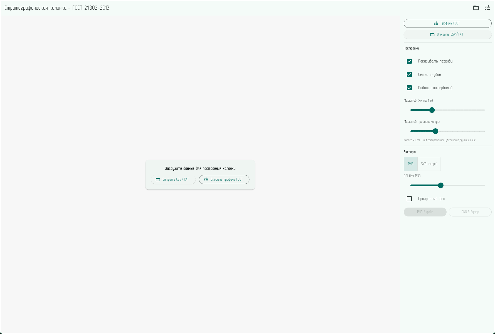
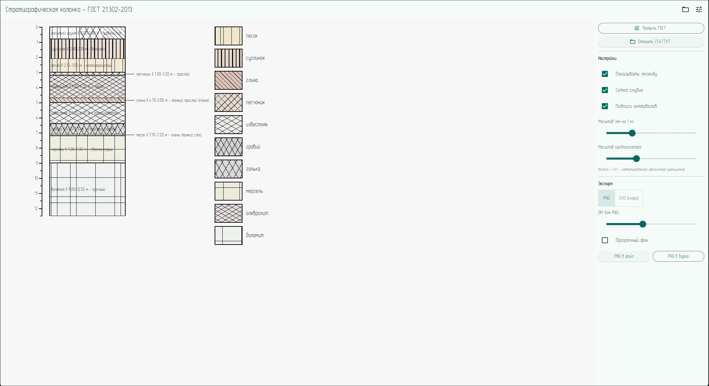
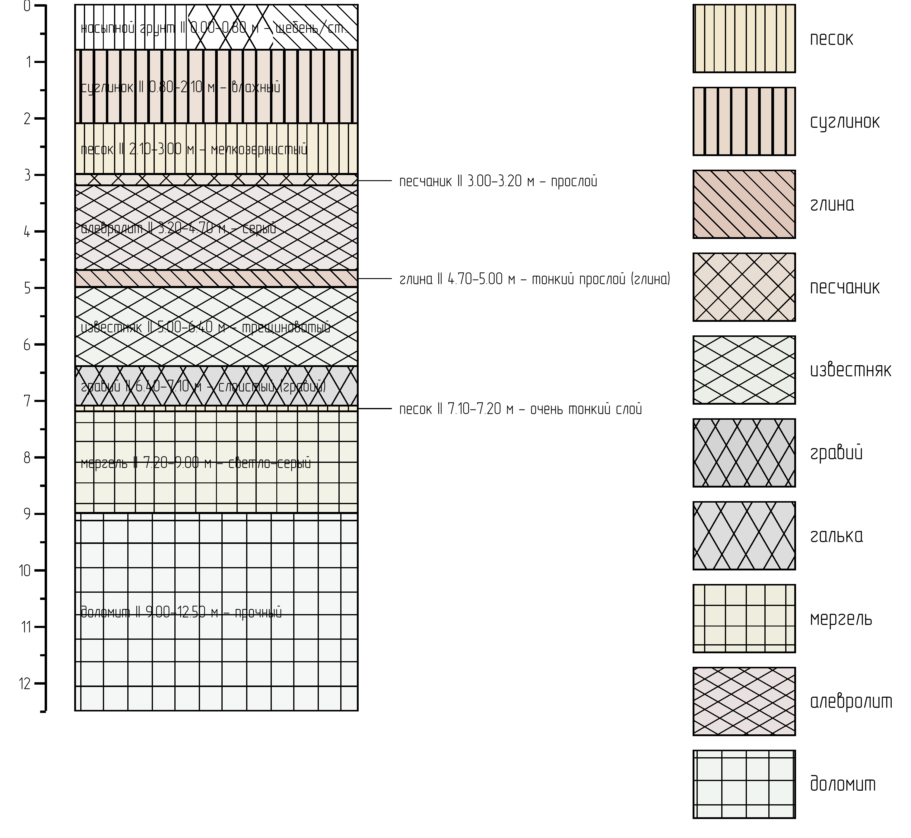

# Strat Column Builder

Приложение для построения стратиграфических колонок по ГОСТ 21.302-2013.  
Поддерживает импорт данных из CSV/TXT, профили ГОСТ в TOML, визуализацию с корректными штриховками и экспорт в PNG (SVG в разработке).

## Возможности
- Импорт CSV/TXT с поддержкой русских и английских заголовков (`от|from`, `до|to`, `литология|lithology`, `состав|composition`, `примечание|note`).
- Поддержка многокомпонентного состава (`песок:70; галька:30`).
- Профили ГОСТ через TOML: описания литологий, цвета, штриховки, легенды.
- Настраиваемый масштаб, легенда, сетка глубин, подписи интервалов.
- Экспорт в PNG c Hi-DPI, tight-bounds, прозрачным фоном.
- Windows/Linux desktop-сборки (Flutter).

## Установка и запуск
Требуется [Flutter](https://flutter.dev).

```bash
git clone https://github.com/crispuscrew/strat-column-builder.git
cd strat-column-builder
flutter pub get
flutter run -d linux   # или windows
```

## Сборка релиза
```bash
flutter build windows --release
flutter build linux --release
```

Собранные бинарники лежат в `build/windows/x64/runner/Release/` и `build/linux/x64/release/bundle/`

## Скриншоты


